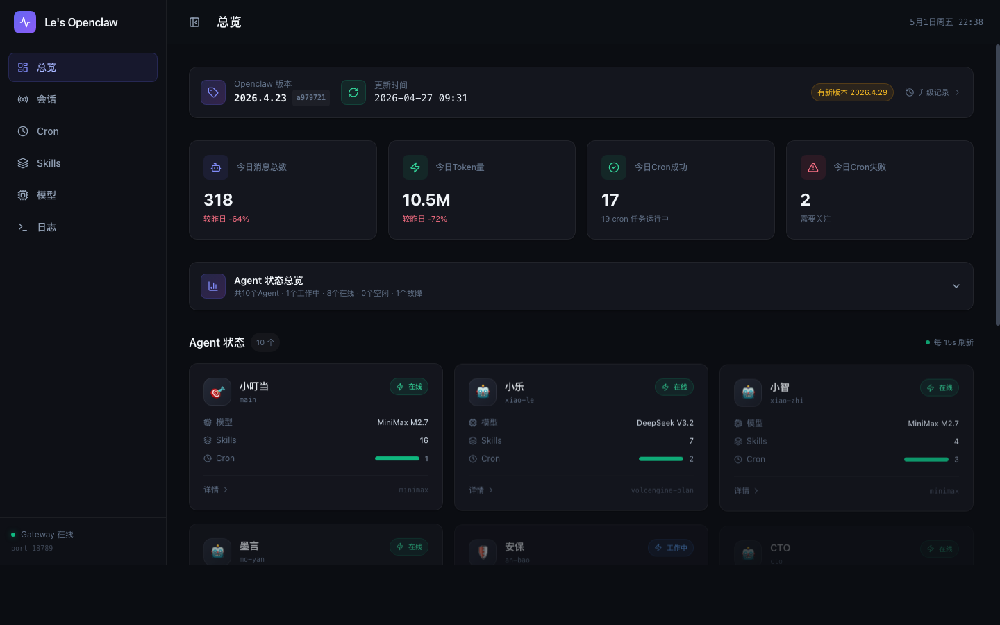

# OpenClaw Web Dashboard

> 🌐 专为 [OpenClaw](https://github.com/leisuremale/OpenClaw) 打造的本地监控面板，全面替代原版 WebUI。

本地运行的智能仪表盘，实时监控 Agent 状态、Cron 任务、模型用量、系统日志，提供深度数据洞察与历史趋势分析。

[](LICENSE)
[](https://www.python.org/)
[](https://react.dev/)
[](https://www.typescriptlang.org/)
[](https://fastapi.tiangolo.com/)
[](https://tailwindcss.com/)

---

## 📸 预览

### 总览仪表盘


> 💡 更多页面截图请参见下方 [功能介绍](#-功能亮点) 章节。

---

## ✨ 功能亮点

### 📊 总览页（Overview）
- **四大 KPI 卡片**：今日消息总数、今日 Token 量、今日 Cron 成功/失败数，带较昨日涨跌对比
- **Agent 状态总览**：工作中 / 在线 / 空闲 / 故障 实时统计，点击展开性能对比模态框
- **Agent 对比图表**：7 天横向分组柱状图，多 Agent 并列对比消息量 / Token / 响应时间
- **版本信息横幅**：显示当前安装版本、commit 哈希、更新检查，一键查看历史升级记录

### ⏱ Cron 时间线
- 所有 Cron 任务的执行历史时间线视图
- 区分成功/失败状态，展示最近执行时间与结果
- 快速查阅每个定时任务的健康状况

### 🤖 Agent 详情
- 点击任意 Agent 进入详情页，查看关联 Cron 任务与技能列表
- **7 天性能趋势图**：纯 SVG 无依赖图表，消息量 / Token 用量 / 响应时间三指标
- 状态实时检测（基于 15 分钟窗口的文件时间戳）

### 🧠 Skills 技能管理
- 自动扫描所有 `workspace-*/skills/` 目录，发现并展示各 Agent 绑定技能
- 列表/卡片两种视图，技能描述一目了然

### 📡 模型管理
- 列出所有已配置的模型 Provider 及模型列表
- **用量概览**：MiniMax 自动抓取用量数据（百分比进度条 + 已用/总额配比）
- 支持手动刷新模型用量数据

### 📜 日志查看
- 实时查看 Dashboard 服务的 stdout / stderr 日志
- **智能日志洞察**：自动识别卡住 Session、LLM 超时、错误/警告模式
- 每 10 秒自动刷新，统计标签 + 逐条洞察卡片

### 🔄 Active Sessions（活跃会话）
- 跨 Agent 查看所有 15 分钟内活跃的会话
- 区分用户会话与 Cron 会话
- 展示会话 ID、Agent 信息、最后活跃时间

### 🔔 版本检查
- 实时查询 npm registry 获取最新 OpenClaw 版本
- 后台异步线程刷新，6 小时缓存，请求不阻塞页面
- **升级历史时间线**：多源融合（plugin-runtime-deps + backup 文件名 + 本地版本），精确定位安装时刻

---

## 🚀 快速开始

### 一键安装

```bash
git clone https://github.com/leisuremale/openclaw-webui-dashboard.git
cd openclaw-webui-dashboard
./install.sh
```

`install.sh` 会：
1. 在 `backend/.venv/` 建立 Python 虚拟环境并安装依赖
2. 在 `frontend/` 运行 `npm ci`
3. 运行 `npm run build` 产出 `frontend/dist/`

可选标志：`--backend` / `--frontend` / `--no-build`。

### 运行（生产模式：FastAPI 同时托管 SPA + API）

```bash
backend/.venv/bin/python -m uvicorn app.main:app \
  --app-dir backend \
  --host 127.0.0.1 --port 18790
```

打开 <http://127.0.0.1:18790> 即可访问。

### 开发模式（前后端分离）

```bash
# Terminal 1：FastAPI（端口 18790）
backend/.venv/bin/python -m uvicorn app.main:app \
  --app-dir backend --host 127.0.0.1 --port 18790 --reload

# Terminal 2：Vite 开发服务器（端口 5173，自动代理 /api）
cd frontend && npm run dev
```

打开 <http://localhost:5173>。

### 重新构建前端

```bash
cd frontend && npm run build   # 产物落到 frontend/dist/
```

---

## 🔐 安全与鉴权

仪表盘默认**只接受回环（loopback）连接**：来自 `127.0.0.1`、`::1` 或 `localhost` 的请求直接放行。

### 远程访问

如果需要从局域网或反向代理访问，必须设置 `OPENCLAW_DASHBOARD_TOKEN`：

```bash
export OPENCLAW_DASHBOARD_TOKEN="$(openssl rand -hex 32)"
```

非回环请求需要在 `Authorization` 头部带：

```
Authorization: Bearer <token>
```

未设置 token 时，非回环请求一律 403。

### 反向代理

为防止伪造 `X-Forwarded-For` 头绕过 loopback 鉴权，**任何带 `X-Forwarded-For` / `X-Real-IP` / `Forwarded` / `X-Forwarded-Host` 头的请求都视为非 loopback**，必须带 Token——即使 `request.client.host == 127.0.0.1`。

若你确实在受信代理后运行（并且该代理会剥离客户端伪造的转发头），显式 opt-in：

```bash
export OPENCLAW_DASHBOARD_TRUST_PROXY=1
```

### CORS

默认允许 `http://localhost:5173` 与 `http://127.0.0.1:5173`。覆盖：

```bash
export OPENCLAW_DASHBOARD_CORS="https://dashboard.example.com,https://localhost:5173"
```

设为 `*` 表示放行所有来源（不推荐）。注意：浏览器规范不允许 `Access-Control-Allow-Origin: *` 与凭证请求共存，因此 `*` 时启动期会强制 `allow_credentials=False` 并打 warning，浏览器 `fetch()` 的 `Authorization` 头将不被发送——`*` 与 Token 鉴权事实上互斥。

### 路径守卫

- `/api/logs/{type}` 仅接受 `stdout` 或 `stderr`（用 FastAPI `Literal`，非法值自动 422）
- `/api/open-path` 仅接受 `~/.openclaw/` 内的路径；**逐层 `lstat` 拒绝任何 symlink**（不再只看终态），可执行文件用平台相关的判定（POSIX 看 mode bits，Windows 看扩展名），`.app` 包仍拒绝
- 文件管理器 reveal 跨平台：macOS=`open -R`、Windows=`explorer.exe /select,`、Linux=`xdg-open <parent dir>`

---

## 🛠 管理命令（macOS / launchctl）

> 以下命令仅在通过 launchctl 注册了 `com.openclaw.dashboard` 时适用。

| 操作 | 命令 |
|------|------|
| 查看日志 | `tail -f ~/.openclaw/dashboard/logs/stderr.log` |
| 重启服务 | `launchctl kickstart -k gui/$(id -u)/com.openclaw.dashboard` |
| 停止自启动 | `launchctl unload ~/Library/LaunchAgents/com.openclaw.dashboard.plist` |
| 重新启用自启动 | `launchctl load ~/Library/LaunchAgents/com.openclaw.dashboard.plist` |
| 查看 API 文档 | 开发模式下打开 `http://localhost:18790/docs` |

`start.sh` 也支持通过环境变量覆盖路径：

| 环境变量 | 默认值 | 说明 |
|---------|-------|------|
| `OPENCLAW_HOME` | `$HOME/.openclaw` | OpenClaw 数据根目录 |
| `OPENCLAW_DASHBOARD_DIR` | `$OPENCLAW_HOME/dashboard` | Dashboard 安装目录 |
| `OPENCLAW_VENV_PYTHON` | `$OPENCLAW_DASHBOARD_DIR/backend/.venv/bin/python3` | Python 解释器 |
| `OPENCLAW_NODE_BIN` | `$HOME/.openclaw/tools/node-v22.22.0/bin/node` | Node 二进制 |
| `OPENCLAW_DASHBOARD_TOKEN` | _未设置_ | 非 loopback 请求的 Bearer token |
| `OPENCLAW_DASHBOARD_CORS` | `http://localhost:5173,http://127.0.0.1:5173` | 允许的 CORS 源（逗号分隔；`*` 会强制关闭 credentials） |
| `OPENCLAW_DASHBOARD_TRUST_PROXY` | _未设置_ | 设为 `1` 才允许带转发头的 loopback 请求跳过 token |

---

## 📡 API 端点

| 方法 | 端点 | 说明 |
|------|------|------|
| `GET` | `/api/health` | 健康检查 |
| `GET` | `/api/overview` | 总览数据（KPI + Agent 状态 + 版本信息） |
| `GET` | `/api/agents` | 所有 Agent 列表 |
| `GET` | `/api/agents/metrics` | 所有 Agent 7 天性能数据汇总 |
| `GET` | `/api/agents/{id}/metrics` | 指定 Agent 每日消息/Token/响应时间（UTC bucket） |
| `GET` | `/api/cron` | Cron 任务列表及执行历史 |
| `GET` | `/api/skills/{agent_id}` | 指定 Agent 的技能列表 |
| `GET` | `/api/models` | 模型 Provider 和模型信息 |
| `GET` | `/api/models/usage` | 缓存的模型用量数据 |
| `POST`| `/api/models/usage/refresh/{provider}` | 启动后台刷新（`minimax` / `deepseek`），立即返回 `{ok, running, started_at}` |
| `GET` | `/api/models/usage/refresh/{provider}/status` | 查询某 Provider 的刷新任务状态（运行中 / 完成 / 失败 + 耗时） |
| `GET` | `/api/collab/status` | 协同调度（ACP）状态：工具就绪、活跃任务、历史、今日统计 |
| `GET` | `/api/sessions/active` | 所有活跃会话（15 分钟窗口） |
| `GET` | `/api/logs/{stdout\|stderr}` | 查看 Dashboard 日志（仅这两个值） |
| `GET` | `/api/logs/analysis` | 日志智能分析洞察 |
| `GET` | `/api/version` | 当前版本信息 + 更新检查 |
| `GET` | `/api/version/history` | 版本升级历史记录 |
| `GET` | `/api/open-path` | 在 Finder 中显示指定路径（仅 `~/.openclaw/` 内，禁止可执行文件） |

未匹配到的 `/api/*` 路径返回 404（不再降级为 SPA 外壳）。

---

## 🧱 技术栈

| 层级 | 技术 | 说明 |
|------|------|------|
| **后端框架** | FastAPI 0.115 | 高性能异步 Python Web 框架 |
| **前端框架** | React 19 + TypeScript 5 | 声明式 UI 与类型安全 |
| **构建工具** | Vite 8 | 极速 HMR 开发体验 |
| **样式方案** | Tailwind CSS 3 | 原子化 CSS，暗色主题适配 |
| **图标** | Lucide React | 现代开源图标库 |
| **UI 组件** | Radix UI | 无障碍原语（Tabs / Tooltip / Collapsible） |
| **日期处理** | date-fns | 轻量级日期格式化 |
| **YAML 解析** | PyYAML 6 | SKILL.md frontmatter |
| **后端服务器** | Uvicorn | ASGI 高性能服务器 |
| **数据源** | 文件系统直读 | 零数据库依赖，直接从 `~/.openclaw/` 读取 |

---

## 📁 项目结构

```
openclaw-webui-dashboard/
├── README.md                          # 本文件
├── MEMORY.md                          # 开发历程与决策记录
├── install.sh                         # 一键安装（venv + npm + build）
├── start.sh                           # 启动脚本（macOS launchd 友好）
├── docs/
│   └── MAC_VALIDATION.md              # 在另一台 Mac 验证的清单
├── .github/workflows/
│   └── ci.yml                         # PR/push 触发的 CI
├── screenshots/                       # 截图（用于文档）
├── backend/
│   ├── app/
│   │   ├── main.py                    # FastAPI 入口 + 鉴权 + 静态托管
│   │   ├── routers/
│   │   │   └── overview.py            # 全部 API 路由（带白名单守卫）
│   │   ├── services/
│   │   │   ├── openclaw.py            # OpenclawService 主类
│   │   │   └── helpers/               # 纯函数（YAML/Cron/原子写）
│   │   │       ├── agents.py
│   │   │       ├── atomic_io.py
│   │   │       ├── cron_format.py
│   │   │       └── skills_parser.py
│   │   └── models/                    # Pydantic 数据模型
│   ├── data/                          # 持久化数据（版本历史、用量缓存）
│   ├── scripts/                       # 辅助脚本（MiniMax / DeepSeek 刷新）
│   └── requirements.txt               # Python 依赖
└── frontend/
    ├── src/
    │   ├── App.tsx                    # 应用入口 + 页面路由
    │   ├── components/
    │   │   ├── Layout.tsx             # 全局布局
    │   │   ├── Overview.tsx           # 总览仪表盘
    │   │   ├── AgentCard.tsx          # 单个 Agent 卡片
    │   │   ├── VersionHistoryModal.tsx
    │   │   ├── CronDetailModal.tsx
    │   │   ├── CronTimeline.tsx
    │   │   ├── AgentDetail.tsx
    │   │   ├── AgentMetricsChart.tsx
    │   │   ├── AgentsComparisonModal.tsx
    │   │   ├── chart-utils.tsx        # 共用 SVG 网格组件
    │   │   ├── SkillsPage.tsx
    │   │   ├── ModelsPage.tsx
    │   │   ├── LogViewer.tsx
    │   │   └── ActiveSessions.tsx
    │   ├── lib/
    │   │   ├── api.ts                 # API 客户端（统一 AbortSignal）
    │   │   ├── types.ts               # 共享 API 响应类型
    │   │   ├── chart-utils.ts         # 图表纯函数
    │   │   └── utils.ts               # cn / formatTime / formatDuration
    │   └── ...
    ├── vite.config.ts                 # Vite 配置（dev /api 代理到 18790）
    └── package.json
```

---

## 🧪 设计哲学

- **零数据库**：所有数据实时读取文件系统，无额外存储依赖
- **轻量优先**：无 jQuery、ECharts 等大型库；图表使用纯 SVG，组件使用 Radix 原语
- **暗色风格**：全局暗色主题，减轻长时间监控的视觉疲劳
- **容错设计**：API 逐个降级，单点故障不阻塞整页渲染
- **零阻塞**：后台线程异步刷新数据（版本检查、用量抓取），不影响前端响应
- **默认 fail-safe**：仅监听回环，远程访问需显式提供 token

---

## 🤝 贡献

PR 流程参见 [`.github/workflows/ci.yml`](.github/workflows/ci.yml)。提交前请确保：

```bash
# 前端
cd frontend && npm run lint && npx tsc -b

# 后端
python -m py_compile backend/app/**/*.py
```

详细的迁移与验证步骤参见 [`docs/MAC_VALIDATION.md`](docs/MAC_VALIDATION.md)。

---

## 📄 License

MIT © [leisuremale](https://github.com/leisuremale)
